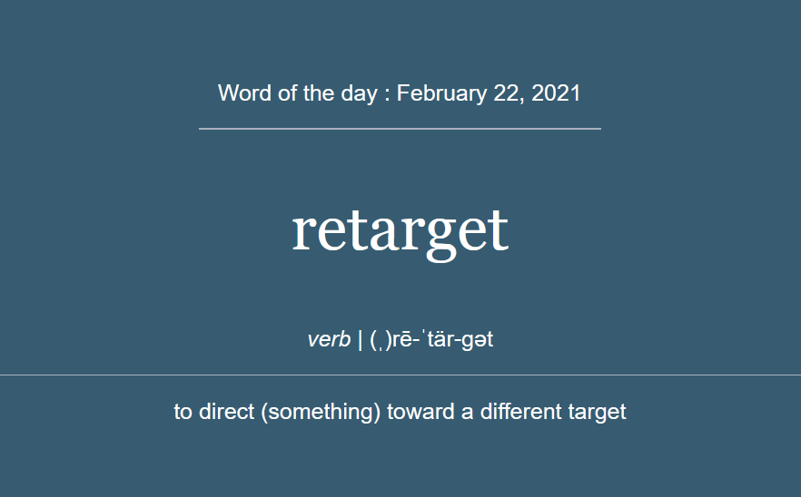

# Word of The Day
This script uses bs4, smtplib, requests, and a couple other standard libraries to get Merriam Webster's word of the day from their public dictionary api. It sends an html email with the word, definition, pronunciation, and today's date. It also, connects to a mariadb mysql server and inserts a row into an existing database table.

# To use
Change the sender and receiver as well as the authentication for your smtp sever.
If you are using gmail, create an app password and use that in this script.
You will also need to register with https://dictionaryapi.com to get an api key. 

# Email Example

